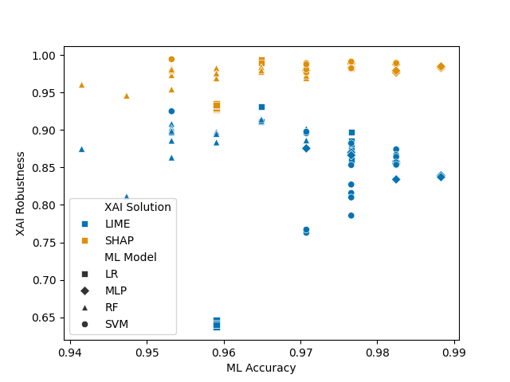
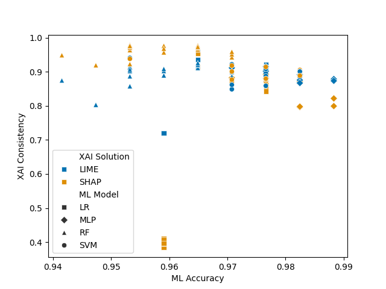
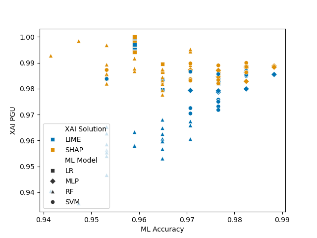

# PEX

## The Best Models do not Produce the Best Explanations

In the paper, we showed in Section 2 that the best ML models do not always produce the best explanations, and we argue that a compromise between ML performance and explanations quality is necessary in practice. 

This repository extends that Section by presenting similar results on other datasets.

### Breast Cancer dataset

<table>
  <tr>
    <td></td>
    <td></td>
  </tr>
  <tr>
    <td></td>
    <td></td>
  </tr>
</table>

